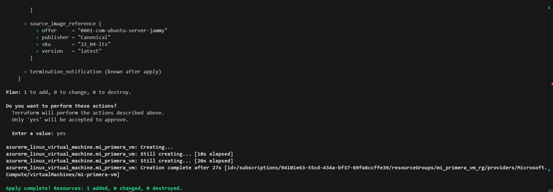

# Terraform Virtual Machine Workshop

Este taller tiene como objetivo desplegar una máquina virtual (VM) utilizando Terraform. A continuación, se detallan los pasos esenciales para la configuración y despliegue de la infraestructura.  

## By

Yuluka Gigante Muriel

---

## Inicialización del proyecto  

Antes de comenzar, es necesario inicializar el directorio de trabajo con Terraform. Esto se hace ejecutando:  

```bash
terraform init
```  

Este comando descarga los proveedores necesarios y prepara el entorno para trabajar con Terraform.


## Validación de la configuración  

Para estar seguros de que la configuración es correcta y no tiene errores de sintaxis, se usa el comando:  

```bash
terraform validate
```  


Dado que no se muestran errores, se puede saber que la configuración es válida.

## Uso de variables para una mejor organización  

Es recomendable refactorizar el código y utilizar variables para mejorar la calidad y reutilización del mismo. Para ello, se debe crear el archivo `variables.tf` y definir las variables necesarias.  

Dentro de este archivo, las variables se deben definir así:

```hcl
variable "variable_name" {
  description = "Descripción de la variable"
  type        = tipo
  default     = "valor_de_la_variable"
}
```

Por ejemplo:


Luego, dentro de `main.tf`, deben usarse de esta manera:

```hcl
resource "resource" "resource_name" {
  name     = var.variable_name
  location = var.variable_name2
}
```

Por ejemplo:


## Verificación de la infraestructura  

Antes de aplicar los cambios, se pueden previsualizar qué recursos se crearán, y si hay algún problema con estos, ejecutando:

```bash
terraform plan
```

El resultado de este comando se verá así:


En caso de que todo sea correcto, se debe aplicar la configuración para desplegar la infraestructura:  

```bash
terraform apply
```

El resultado de este comando debería verse así:





## 5. Comprobación de los recursos  

Para verificar que los recursos se han creado correctamente, se puede revisar en el panel de administración:  


## 6. Conexión a la Máquina Virtual  

Si todo está funcionando correctamente, ahora se puede hacer la conexión a la VM mediante SSH. 

Para esto, se puede ver la IP pública de la VM, entrando al recuerso dentro de Azure:


Teniendo esta información, y las credenciales definidas en el proyecto, el comando a ejecutar es:

```bash
ssh adminuser@40.119.137.239
```

El resultado debería verse así:


La conexión fue exitosa, lo que indica que la infraestructura está funcionando bien :-)